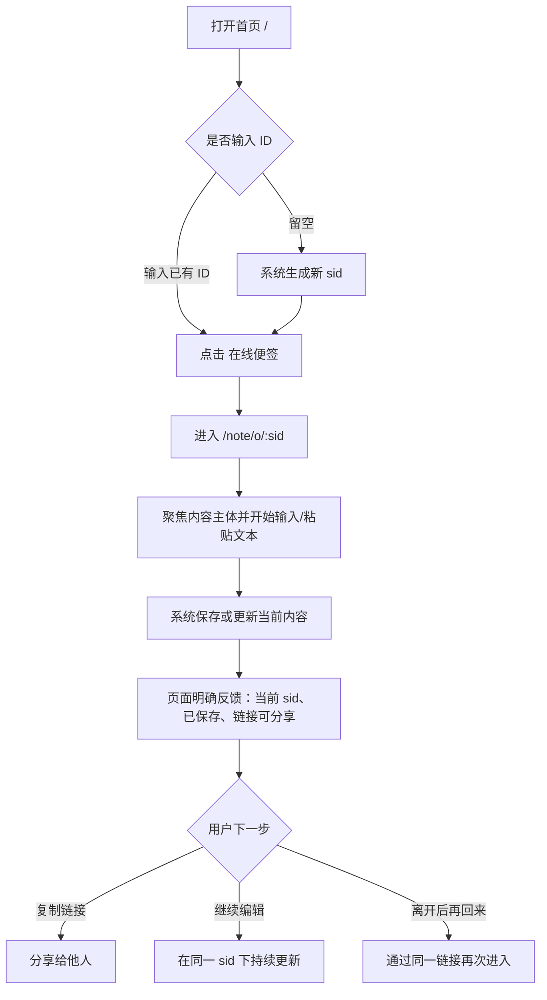
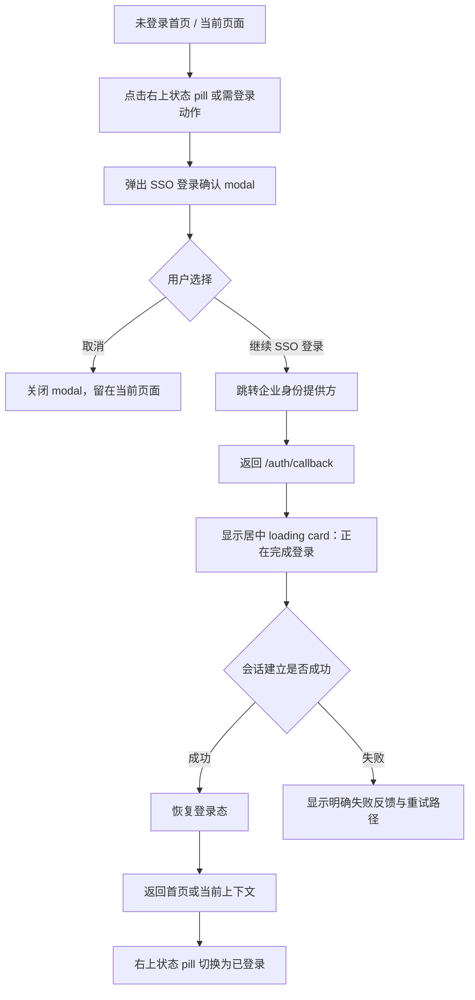
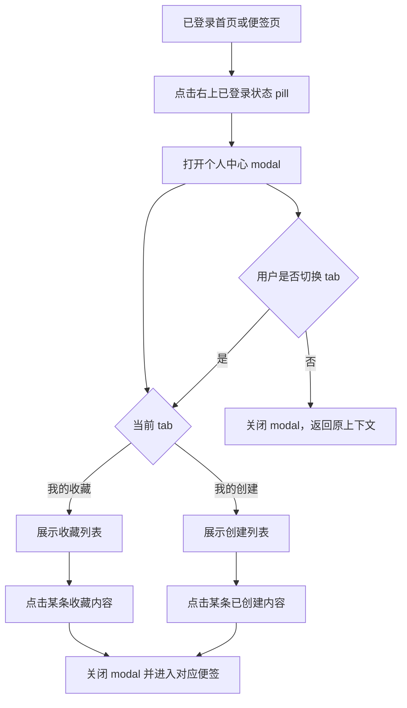

---
stepsCompleted:
  - 1
  - 2
  - 3
  - 4
  - 5
  - 6
  - 7
  - 8
  - 9
  - 10
  - 11
  - 12
  - 13
  - 14
lastStep: 14
inputDocuments:
  - "/Users/reuszeng/Code/Projects/note/_bmad-output/planning-artifacts/product-brief-note.md"
  - "/Users/reuszeng/Code/Projects/note/_bmad-output/planning-artifacts/product-brief-note-distillate.md"
  - "/Users/reuszeng/Code/Projects/note/_bmad-output/planning-artifacts/prd.md"
  - "/Users/reuszeng/Code/Projects/note/_bmad-output/planning-artifacts/architecture.md"
  - "/Users/reuszeng/Code/Projects/note/_bmad-output/planning-artifacts/research/technical-note-frontend-backend-architecture-research-2026-04-01.md"
  - "/Users/reuszeng/Code/Projects/note/_bmad-output/project-context.md"
  - "/Users/reuszeng/Code/Projects/note/docs/tech-solution.md"
  - "/Users/reuszeng/Code/Projects/note/docs/database-design.md"
  - "/Users/reuszeng/Code/Projects/note/docs/note.pen"
---

# UX Design Specification note

**Author:** Youranreus
**Date:** 2026-04-02

---

<!-- UX design content will be appended sequentially through collaborative workflow steps -->

## Executive Summary

### Project Vision

`note` 的产品愿景不是成为重型笔记工具，而是成为用户“先记下来、先发出去、后续还能继续维护”的默认文本入口。它通过固定 `sid` 把一次性分享升级为可持续更新的稳定链接，同时通过登录和个人面板把临时内容逐步承接为可管理的个人资产。

从 UX 角度看，`note` 的核心价值不是功能堆叠，而是体验顺序的重新设计：先使用，再登录；先分享，再管理；先开放阅读，再收拢编辑。用户不需要先理解复杂系统，只需要在最短路径上完成“输入/生成 ID -> 进入便签 -> 分享/继续编辑”这一主任务。

### Target Users

主要用户是有高频碎片化记录与文本分享需求的个人用户，例如开发者、学生、内容工作者和需要快速同步说明信息的人。他们共同的特点是：不愿在记录当下做复杂决策，重视打开即写、链接稳定、后续易回访。

次级用户是已经形成轻量记录习惯、希望把零散内容逐步沉淀为可管理资产的人群。这类用户会更频繁使用“我的创建”“我的收藏”与登录能力，对他们来说，产品不仅要快，还要具备从临时工具升级为长期工具的承接能力。

分享内容的接收者也是关键用户角色。他们通常通过链接直接进入内容页，优先需求是“快速打开、稳定查看、必要时收藏”，而不是复杂编辑。因此产品必须确保阅读路径天然轻量，不被登录或管理逻辑打断。

### Key Design Challenges

1. 需要把“固定 `sid`”设计成降低阻力的机制，而不是让用户额外思考的负担。用户应该感知到它带来的是稳定链接和持续更新，而不是一次新的输入成本。
2. 需要把“查看开放、编辑受控”的权限模型讲清楚。登录创建者默认编辑权、编辑密钥共享编辑权、未登录阅读与登录收藏之间的关系，如果表达不清，会直接造成认知混乱。
3. 需要在“双态产品”中保持统一体验。在线便签和本地便签必须语义清晰，但界面语言、入口结构和基本交互不能割裂，否则用户会把它理解成两个松散功能而不是一个产品。
4. 需要让登录成为能力升级而不是门槛。用户在未登录状态下也应顺畅完成核心动作，而在需要收藏、查看个人资产、恢复身份时，自然理解登录的价值。
5. 需要在轻量产品中处理好删除、异常状态和 SSO 回跳等高风险节点。由于产品路径短，任何一次失败反馈、状态不明或跳转中断都会放大挫败感。

### Design Opportunities

1. 可以把首页做成极低决策压力的入口，让用户几乎不需要思考就能开始。只保留最关键动作，有机会形成明显优于传统笔记工具的“启动速度”体验。
2. 可以把“持续更新的同一链接”塑造成产品最强记忆点。只要分享后的反馈、便签详情页状态和更新后的回访感受足够明确，用户会更容易理解产品与普通分享页的差异。
3. 可以把用户信息面板做成轻量但高价值的资产承接层，而不是独立复杂后台。通过“我的创建 / 我的收藏”双 tab，把登录后的价值具象化，而不打断主流程。
4. 可以利用 SSO 回调页、收藏动作、密钥编辑提示和删除确认这些关键节点，建立一致且克制的反馈语言，让产品看起来简单，但在复杂状态下依然可靠。
5. 由于该产品同时面向桌面和移动链接消费场景，响应式设计有机会成为竞争优势。只要首页、详情页和用户面板在手机端同样顺手，分享链路的实际完成率会更高。

## Core User Experience

### Defining Experience

`note` 的核心体验不是“写一条便签”，而是“用极低摩擦生成一条可持续更新、可立即分享的文本链接”。用户进入产品后，不应先被组织结构、账号体系或复杂设置打断，而应快速完成 ID 确认、内容进入与链接分享。

这个产品的体验重心是“先发出去，再慢慢完善”。因此系统要允许用户在内容尚未完全定稿时，先获得一个稳定的访问地址，并在同一 `sid` 下持续更新。对用户来说，真正决定产品价值的不是编辑器有多强，而是分享动作是否足够快、后续维护是否足够自然、链接是否足够稳定。

### Platform Strategy

`note` 以 Web 为唯一核心平台，采用浏览器中的轻量应用体验承接“创建、查看、更新、收藏、资产管理”这整条链路。首版不需要扩展成独立桌面应用或原生移动应用，但必须确保桌面端与移动端在关键路径上的一致可用性。

交互方式以鼠标键盘为主，同时兼容移动端触控打开链接、查看内容、执行基础操作。首页、在线便签详情页、本地便签页、SSO 回调页和用户面板都必须具备响应式适配能力。产品不以离线优先为目标，但本地便签模式天然承担“无需远端即可快速记录”的补位作用。

### Effortless Interactions

以下交互必须做到几乎不需要思考：

- 用户进入首页后，立即理解“输入 ID 或直接开始”的路径，不需要学习成本。
- 当未输入 `sid` 时，系统自动生成可用标识，避免用户被空状态卡住。
- 用户点击在线便签或本地便签时，能快速进入对应模式，不需要额外确认。
- 在线便签保存、更新、收藏、删除等关键动作必须有立即且明确的反馈，避免用户猜测系统是否成功。
- 接收者通过分享链接打开内容时，应默认直接进入可阅读状态，而不是先被登录或复杂提示阻断。
- 登录后用户重新回到当前流程时，应感知为“能力升级”，而不是“被迫重新开始”。

### Critical Success Moments

以下时刻是体验成败的关键节点：

1. 用户第一次打开首页并在极短时间内进入便签页。
2. 用户首次拿到固定 `sid` 并理解“这个链接之后还可以继续更新”。
3. 用户完成首次保存或更新后，确认内容已经稳定挂载在同一地址下。
4. 接收者第一次通过链接打开内容并顺利阅读，没有被权限或登录逻辑打断。
5. 用户第一次登录后看到“我的创建 / 我的收藏”，意识到自己的内容开始被承接为资产。
6. 用户在口令错误、无权限、内容删除、回调失败等异常情况下，仍能明确理解当前状态并知道下一步该做什么。

### Experience Principles

1. 先完成任务，再解释系统。任何设计都应优先帮助用户快速开始，而不是要求用户先理解完整规则。
2. 固定链接必须被感知为价值，而不是实现细节。`sid` 的存在要服务于“稳定分享、持续更新”这一核心心智。
3. 阅读路径默认轻，编辑权限默认稳。查看应足够开放，编辑应足够克制，权限提示应足够清楚。
4. 登录是升级，不是门槛。未登录用户应能顺畅完成主要浏览与创建路径，登录只在需要资产化时出现其价值。
5. 轻量不等于模糊。越是短路径产品，越要在保存、删除、收藏、异常状态和跳转反馈上做到明确可靠。

## Desired Emotional Response

### Primary Emotional Goals

`note` 的首要情绪目标应是“轻松”和“放心”。用户打开产品时，应感受到这是一个不需要准备、不需要学习、也不会立刻给自己增加负担的工具。它应该像拿起一张纸那样直接，但又比纸更可靠，因为用户知道这条内容可以被稳定保存、继续更新并随时分享。

第二层核心情绪是“掌控感”。无论是创建者、接收者还是登录后的资产管理用户，都应感到系统边界是清楚的：什么可以看，什么可以改，什么时候需要登录，什么时候只是继续当前动作。产品不应该让用户猜系统状态，而应该让用户感觉“我知道现在发生了什么，也知道下一步怎么做”。

### Emotional Journey Mapping

- 首次发现产品时，用户应感到低压力和低门槛，觉得“这个东西我现在就能用”。
- 进入核心流程时，用户应感到顺滑和高效率，不被无关判断打断。
- 完成首次创建、保存或分享时，用户应感到明确的完成感，意识到自己已经得到一个稳定可用的结果。
- 通过链接再次打开内容时，用户应感到可靠与连续，确认这不是一次性页面，而是一个可维护的稳定入口。
- 登录后看到“我的创建 / 我的收藏”时，用户应感到内容开始被承接，产品从临时工具升级为个人资产入口。
- 遇到异常、无权限、口令错误、内容失效或回跳失败时，用户应感到被清楚告知，而不是被系统抛下或羞辱。

### Micro-Emotions

对 `note` 成功最关键的微情绪包括：

- 信心而不是困惑：用户要能迅速理解当前模式、当前权限和当前结果。
- 信任而不是怀疑：保存、更新、分享、删除都必须让用户相信系统状态真实可靠。
- 轻快而不是拖滞：首页、进入详情页、回跳恢复等路径要避免沉重感和等待焦虑。
- 安全而不是失控：编辑权限、密钥、删除确认等设计要让用户明确知道哪些行为是可控的。
- 满足而不是炫技惊喜：产品更适合提供“顺手”“对”“稳”的感受，而不是靠过度动效制造兴奋。

### Design Implications

- 如果希望用户感到轻松，首页必须极简，主动作数量要少，文案要避免技术感和术语堆积。
- 如果希望用户感到掌控，保存、收藏、删除、权限失败和回跳恢复都必须有清晰状态反馈，不允许出现“点了但不知道有没有成功”的瞬间。
- 如果希望用户感到信任，固定 `sid`、稳定链接、查看开放与编辑受控这些规则必须被一致表达，不能在不同页面用不同说法。
- 如果希望用户感到安全，删除确认、口令提示、无权限反馈和登录升级路径必须保持克制但明确，既不吓人，也不含糊。
- 如果希望用户持续回访，登录后的用户面板必须让用户明显感受到“这些内容现在归我管理”，而不是只是多了一个列表页。

### Emotional Design Principles

1. 让用户尽快进入“我已经开始了”的状态，而不是停留在“我还在设置”的状态。
2. 每个关键动作都要给出稳定、具体、可信的反馈，持续累积产品信任感。
3. 复杂规则可以存在，但呈现方式必须简单，不把系统复杂度直接抛给用户。
4. 情绪设计优先服务于效率、可靠性和掌控感，而不是追求表面的新奇或热闹。
5. 在异常状态中仍然维持尊重和清晰，这是建立长期信任感的关键。

## UX Pattern Analysis & Inspiration

### Inspiring Products Analysis

**Pastebin**  
Pastebin 最值得借鉴的是它对“快速粘贴一段内容并立即生成一个可访问结果”的交互路径控制。它几乎不要求用户先理解系统结构，也不把管理能力放在主流程前面，而是把“内容输入 -> 生成结果 -> 访问/分享”做成极短链路。对 `note` 来说，这种模式非常契合首页和在线便签主流程。

它的另一个关键价值是对象感很强。用户不会把 Pastebin 的结果理解为“某个复杂文档系统中的一页”，而是理解为“我刚刚创建的这一条文本内容”。这对 `note` 非常重要，因为 `note` 也应该让用户把每个 `sid` 理解成一个独立、稳定、可继续维护的文本对象。

**Simplenote**  
Simplenote 仍然适合作为次级参考，主要借鉴它的低视觉噪音和快速进入感。它提醒我们，轻量文本产品不需要复杂外壳，只需要让用户尽快进入输入状态，并减少界面对主任务的干扰。

但 `note` 不应完全像 Simplenote，因为 `note` 还承担分享、固定链接、权限收拢与收藏承接等能力，所以它需要比 Simplenote 多一点状态表达。

### Transferable UX Patterns

**Navigation Patterns**

- 首页只保留单一核心入口，像 Pastebin 一样把“输入内容 / 输入 ID / 进入结果页”放在最中心位置。
- 结果页优先于后台管理页。用户创建内容后，应优先看到自己的便签结果和稳定链接，而不是先进入资产管理视图。
- 资产管理作为后置增强层出现，而不是主导航骨架。`我的创建 / 我的收藏` 应该是登录后的补充能力，不应主导首页结构。

**Interaction Patterns**

- 快速创建优先于完整设置。应尽量减少“创建前配置”，让用户先进入便签，再决定是否补密钥、登录、收藏或管理。
- `sid` 应该像 Pastebin 的 key 一样，成为内容对象的自然标识，而不是技术字段。
- 创建后立即进入结果页，并明确告诉用户“这个地址已经可访问，并且后续可以继续更新”。
- 编辑、保存、删除等动作应保持直接，不应引入层层确认；只有删除这种不可逆动作需要明确阻断式确认。
- 阅读者通过链接进入时，默认先看到内容本身，而不是产品结构或账户体系。

**Visual Patterns**

- 页面结构应更接近“单任务界面”，避免同时并列太多功能区。
- 输入区、主按钮、结果状态和链接入口应成为视觉核心，次要操作后置处理。
- 视觉上要强调“这是一条独立文本”，而不是“一个复杂系统里的页面模块”。
- 管理面板、收藏状态、权限提示应存在，但应明显弱于内容主体和主流程按钮。

### Anti-Patterns to Avoid

- 避免借用文档工具式的重型信息架构，例如多层侧边栏、复杂对象树、强后台感布局。
- 避免在创建前要求用户先配置过多选项，例如权限、格式、归属、登录方式等。
- 避免让首页承担过多说明职责。首页应先让用户开始，而不是先教育用户。
- 避免把“我的创建 / 我的收藏”做成与主流程竞争注意力的一级入口。
- 避免把 `sid` 做成难理解的技术概念；它应该被感知为链接标识，而不是数据字段。
- 避免让结果页像编辑后台，而不是像一个已经生成、可以被访问和维护的文本对象。

### Design Inspiration Strategy

**What to Adopt**

- Adopt Pastebin 式的超短主路径，因为它最符合 `note` 的低摩擦创建与分享目标。
- Adopt Pastebin 式“结果对象优先”的界面思路，让用户先看到自己刚创建出的文本入口。
- Adopt Simplenote 式的低噪音视觉原则，减少不必要装饰和控制项。

**What to Adapt**

- 将 Pastebin 的一次性发布心智改造成“固定链接可持续更新”的版本，这是 `note` 与它最本质的差异。
- 将 Pastebin 相对弱的资产管理能力补成登录后的轻量面板，但不破坏主路径。
- 将轻量文本输入体验与权限模型结合，让“查看开放、编辑受控”在结果页中自然表达出来。

**What to Avoid**

- 避免走向文档平台化、协作平台化或知识库化，那会稀释 `note` 的核心价值。
- 避免把登录、收藏、管理能力前置到创建前。
- 避免让界面从“快速贴出一段内容”变成“经营一个复杂对象系统”。

## Design System Foundation

### 1.1 Design System Choice

`note` 应采用“Tailwind CSS + 轻量自定义组件层”的设计系统方案，而不是完整现成组件库或一开始就投入大量资源建设全量自研设计系统。

这个选择的核心原因在于：`note` 的交互模式更接近 Pastebin 式单任务文本产品，重点是快速进入、内容优先、低视觉噪音和明确状态反馈，而不是复杂后台、标准化企业表单或大规模组件矩阵。使用重型现成设计系统虽然能加快部分开发，但会显著抬高界面的“系统感”和“后台感”，削弱产品最关键的轻量特质。

因此，`note` 更适合建立一层非常克制的 UI foundation：通过 Tailwind 提供布局、间距、排版和状态 token，再围绕具体业务抽少量高复用基础组件，例如输入框、主按钮、次按钮、状态提示、对话框、标签切换、列表项和空状态容器。

### Rationale for Selection

1. 该项目强调极短主路径和低摩擦交互，现成重型系统会天然引入过多默认结构、控件样式和后台气质，不利于形成 Pastebin 式体验。
2. 项目当前还处于重构前期，团队更需要快速落地稳定体验，而不是先维护一个复杂组件生态。
3. `Tailwind CSS` 已经是既定技术选型，适合作为设计 token 与样式约束层，能够在保证开发效率的同时保留足够高的视觉自由度。
4. `note` 的核心界面类型相对集中：首页、内容页、回调页、轻量面板和少量反馈状态，不需要大型组件库才能支撑。
5. 轻量自定义组件层更容易把“内容优先、动作直接、状态克制”的产品气质做出来。

### Implementation Approach

实现上应分为三层：

- **Design Tokens 层**  
  定义颜色、字体、字号、圆角、边框、阴影、间距、状态色、层级和动效时长等最小 token。
- **Foundation Components 层**  
  封装基础输入组件、按钮组件、表单容器、模态框、tab、toast/inline feedback、empty state、loading state、列表项容器等。
- **Feature Components 层**  
  在业务模块内实现首页输入区、便签工具条、链接状态条、收藏入口、用户面板列表、删除确认框等面向场景的组件，不把这些过早抽成通用系统组件。

这样可以保证一致性来源于基础层，但不会为了“系统完整性”过度抽象，影响主流程迭代速度。

### Customization Strategy

定制策略应围绕以下原则展开：

- 优先定制排版、间距、层级和状态反馈，而不是追求复杂视觉装饰。
- 首页、内容页和用户面板要共享同一套视觉语言，但首页应更聚焦启动，内容页更聚焦文本对象，面板更聚焦列表承接。
- 所有组件都应遵循“弱容器、强内容、少边框、少装饰”的原则，让文字和主动作成为视觉中心。
- 状态色与反馈方式需要统一，例如保存成功、权限失败、删除风险、加载中、空列表等，都必须有稳定规则。
- 对话框、tab、列表项等少量结构性组件要足够稳定，便于后续“我的创建 / 我的收藏”与权限提示复用。
- 不在早期引入大而全的主题切换、复杂密度系统或大量变体；先保证主链路一致性，再逐步扩展。

最终目标不是做一个可对外售卖的组件库，而是建立一套足够轻、足够稳、足够贴近 `note` 核心交互的 UI 基础设施。

## 2. Core User Experience

### 2.1 Defining Experience

`note` 的 defining experience 是：用户在极短时间内把一段文本变成一个可立即访问、可持续更新、可稳定分享的固定入口。它不是传统意义上的“先创建文档再管理文档”，而是更接近“贴出一段内容，并让这个入口从一开始就可以被持续维护”。

如果这个交互被做对，用户会这样描述产品：我把内容贴进去，系统马上给我一个固定地址；我之后继续改，别人打开的还是同一个地址，而且看到的是最新内容。这个体验比“临时文本分享”更稳定，比“文档工具”更轻，也比“本地便签”更适合跨人传递。

### 2.2 User Mental Model

用户对这个任务的天然心智不是“我要经营一个文档对象”，而是“我现在要把一段内容快速给出去，最好之后还能继续修”。他们通常来自几类既有习惯：

- 使用聊天工具直接发长文本，但很难维护后续版本；
- 使用 Pastebin 类工具快速贴文本，但默认偏一次性发布；
- 使用文档工具分享链接，但进入成本较高、结构偏重；
- 使用本地便签临时记录，但不适合跨人分享。

因此，用户会期待 `note` 像 Pastebin 一样快，像稳定链接工具一样可靠，但不要像协作文档那样重。他们最容易困惑的地方有两个：一是 `sid` 到底是输入成本还是价值载体；二是“谁能看、谁能改、什么时候需要登录”这套规则。如果这两个点被讲清楚，产品心智会非常顺。

### 2.3 Success Criteria

核心交互成功时，用户会明显感到“这比我原来的做法省事”，并且不会怀疑结果是否已经成立。成功标准应包括：

- 用户几乎不需要学习就能开始输入或进入一个便签。
- 用户能快速获得一个固定可访问的入口，而不是停留在未完成状态。
- 用户能明确知道当前内容已经保存或更新成功。
- 用户理解这个入口之后可以继续维护，而不是一次性结果。
- 接收者通过链接打开内容时，不需要额外理解系统就能正常查看。
- 用户在登录、收藏、删除或权限异常等次级操作中，依然不会失去对当前状态的判断。

如果用户在首次使用后愿意再次用同一个 `sid` 更新内容，而不是重新发一份新文本，这就说明 defining experience 已经成立。

### 2.4 Novel UX Patterns

`note` 并不需要发明全新交互手势，它更适合“用成熟模式做一个新的组合”。从模式性质上看，它属于“熟悉交互的重新拼接”：

- 使用 Pastebin 式的快速发布心智；
- 使用稳定链接对象的访问心智；
- 使用轻量资产承接的登录后管理心智；
- 使用受控编辑而非开放协作的权限心智。

它的创新不在于界面操作新，而在于价值组合新。用户不需要被教育如何点击，而需要被清楚地感知：这不是一次性 paste，而是一个可以持续更新的固定文本入口。也就是说，创新重点在反馈和表达层，而不是交互语法层。

### 2.5 Experience Mechanics

**1. Initiation**

- 用户从首页进入，看到极简输入区和两个主入口：在线便签、本地便签。
- 若用户输入已有 `sid`，系统理解为进入既有内容。
- 若用户未输入 `sid`，系统在进入时自动生成可用标识，避免阻塞开始动作。

**2. Interaction**

- 用户选择在线便签后，立即进入对应内容页并聚焦内容主体。
- 用户直接输入、粘贴或更新文本，不需要先完成复杂设置。
- 若需要编辑保护，用户可在结果页中追加密钥或使用现有权限完成编辑。
- 登录、收藏、查看我的创建/收藏都属于主流程后的增强操作，不阻断内容主任务。

**3. Feedback**

- 系统需要持续明确表达当前状态：已进入哪个 `sid`、当前内容是否已保存、是否具备编辑权限、当前链接是否可直接分享。
- 成功反馈应克制但明确，例如保存状态、链接可复制状态、收藏成功状态。
- 失败反馈必须可行动，例如口令错误、无权限、内容失效、删除完成、回调失败时，都应告诉用户发生了什么以及下一步能做什么。

**4. Completion**

- 用户完成交互的标志不是“写完了”，而是“已经拥有一个稳定入口并知道它可继续维护”。
- 对创建者来说，完成态是拿到固定链接并确认内容可持续更新。
- 对接收者来说，完成态是顺利打开并看到正确内容。
- 对登录用户来说，完成态还包括这条内容能够被收藏或被归入个人资产面板中。

## Visual Design Foundation

### Color System

`note` 的颜色系统应以中性底色为主，配合一个克制但有识别度的主色，用来承载主按钮、聚焦态和关键链接动作。整体不适合高饱和、大面积品牌色铺陈，因为产品核心是内容输入、结果查看和状态确认，视觉目标应是稳定、清楚、低疲劳。

推荐颜色策略：

- **Base / Surface**  
  以浅灰白为主背景，正文区域使用纯白或极浅暖灰容器，建立清晰但不厚重的内容承载层。
- **Primary**  
  使用偏深的蓝或蓝绿色作为主交互色，承担主要 CTA、可点击链接、输入聚焦和选中态。该颜色需要传达可靠与可控，而不是娱乐感。
- **Neutral Text**  
  正文文本采用高对比深灰而非纯黑，辅助信息采用中灰，避免页面过硬。
- **State Colors**  
  成功使用偏稳的绿色，警告使用琥珀色，错误使用偏深红，信息提示使用与主色接近的蓝色体系。
- **Risk Colors**  
  删除、不可恢复等终态使用单独的高辨识风险色，但面积需克制，只在需要用户明确警觉时使用。

语义映射应固定为：`primary / secondary / success / warning / danger / info / border / muted / surface / background`，后续所有组件与业务反馈统一依此落地。

### Typography System

`note` 是文本中心产品，因此排版系统比装饰性视觉更重要。字体选择应优先考虑屏幕长时间阅读、内容输入清晰和中英文混排稳定性。

推荐策略：

- **Primary UI Font**  
  使用现代无衬线字体栈，优先系统友好、在中文和英文环境下都稳定的字体组合。
- **Content Font**  
  内容区与界面区可以共用一套无衬线体系，避免切换两套字体造成对象感分裂。
- **Hierarchy**  
  标题层级不需要过多，建议控制在 `H1 / H2 / H3 / Body / Meta / Label` 六个层级内。
- **Scale**  
  首页主标题和结果页关键对象信息要明显大于辅助信息，但整体不应走营销型超大标题路线。
- **Readability**  
  内容正文应采用较宽松的行高，保证便签正文编辑和阅读时都不压迫。
- **Input Clarity**  
  `sid` 输入区、链接状态、保存状态、权限提示等关键微文本需要具备高可辨识度，避免过小字体。

整体语气应偏“现代、直接、可信”，而不是“活泼、装饰性、强品牌表达”。

### Spacing & Layout Foundation

`note` 的布局应围绕“单任务中心”展开，优先保证内容对象和主动作之间的关系清晰。推荐采用 `8px` 作为基础 spacing unit，关键容器按 `8 / 12 / 16 / 24 / 32 / 48` 递进。

布局原则：

- 首页采用中心化单列结构，主输入与两个主入口形成清晰垂直关系。
- 在线便签页以内容主体为中心，工具条和状态条围绕内容对象组织，不应形成多栏后台结构。
- 用户面板采用轻量弹层或抽屉式承载，列表区清晰、信息密度适中，不抢内容主区域的角色。
- 移动端应优先保证主输入区、正文区、主按钮和反馈条完整显示，不依赖 hover。
- 容器边框、分隔线和阴影只用于建立层级，不用于制造装饰感。

建议的空间气质是“中等留白，偏紧凑效率”，不要过于拥挤，但也不做大面积空旷。`note` 更像工具，不像画册。

### Accessibility Considerations

- 正文文本、输入文本、状态文本与背景之间必须满足基础对比度要求，尤其是 `sid`、链接、错误信息和保存状态。
- 关键操作必须支持键盘完成，包括首页进入、保存、复制链接、切换 tab、确认删除等。
- 状态反馈不能只依赖颜色，成功、错误、警告都应同时配合文案或图标。
- 焦点态必须明确可见，尤其是在输入框、主按钮、tab 和弹层操作中。
- 移动端点击区域需要足够大，避免主流程按钮和高频操作过小。
- 删除、权限失败、内容失效等高风险场景的提示必须具备可理解文本，不能只给出抽象错误码。

## Design Direction Decision

### Design Directions Explored

在参考 `note.pen` 实际设计后，本轮方向不再从零发散，而是围绕现有稿件做有限变体。当前设计稿已经明确给出了 5 组核心界面语义：

- 首页采用浅灰背景 + 右上状态 pill + 居中单列 shell
- 主入口由 `ID 输入 + 在线便签 / 本地便签` 两个 52px 按钮组成
- SSO 登录采用遮罩 + 居中确认 modal，而不是整页跳转说明
- 登录回跳采用居中 loading card，语义非常清楚
- 个人中心采用 `620 × 440` modal + segmented tab，作为后置资产层

因此，本轮方向探索的重点不再是“换一种完全不同的产品气质”，而是判断：在保留这套现有视觉骨架的前提下，哪些地方需要更像 Pastebin，哪些地方应继续忠于现稿。

### Chosen Direction

最终建议采用“现有设计稿为主，Pastebin 心智增强”的组合方向：

- 首页与已登录首页：以 `note.pen` 当前结构为基础，保留居中单列 shell、右上状态 pill、浅灰背景和双入口按钮。
- 交互文案与主路径：向 Pastebin 靠拢，强调“输入或留空生成 ID，立即进入便签”的低摩擦心智。
- SSO 登录：继续沿用现稿的遮罩 + modal 方案，不改成独立重页面。
- 回跳加载：继续沿用现稿的居中 loading card，因为它已经很好地表达了“正在完成登录”这一状态。
- 个人中心：继续沿用现稿的 modal + segmented tabs，不改造成独立后台页。

也就是说，应该保留 `note.pen` 的视觉结构，只把主路径表达、结果对象感和链接价值说明做得更强，而不是推翻整套稿件。

### Design Rationale

1. `note.pen` 已经建立了一套稳定且成熟的视觉语法，包括背景、圆角、按钮高度、状态 pill、modal 和卡片层级，这些都不应该被无谓重做。
2. 这套设计本身已经具备轻量、克制、可信的气质，与前面定义的情绪目标高度一致。
3. 真正需要补强的不是视觉风格，而是交互心智表达，尤其是“固定 `sid` 是稳定入口”这件事要更明确。
4. 如果直接转向纯 Pastebin 视觉，会丢掉现稿里已经存在的产品完整性，例如 SSO 浮层、回跳状态卡片和个人中心 modal。
5. 最合理的做法是：视觉上忠于现稿，交互上更接近 Pastebin，形成“轻工具 + 稳对象 + 弱资产层”的最终方向。

### Implementation Approach

实现时建议遵循以下原则：

- 首页继续使用现稿的 `topBar + contentWrap + 460px shell` 结构，不改成全新布局。
- 在线便签与本地便签的按钮样式继续保持当前 52px 高度、12px 圆角和主次按钮关系。
- 右上状态区继续使用 pill 语义，未登录、已登录、打开个人中心都沿用这一视觉入口。
- SSO 流程保持“点击登录 -> modal 确认 -> 回跳加载 card”三段式，不额外扩展解释页面。
- 个人中心继续保持 modal 语义，并通过 segmented tabs 切换“我的收藏 / 我的创建”，不升级为独立后台。
- 后续详细设计只需要重点增强三件事：
  - 首页文案与提示更明确地传达固定入口价值
  - 在线便签结果页更强调“这是一个可持续更新的对象”
  - 资产层继续后置，不抢主流程

## User Journey Flows

### 旅程 1：快速进入在线便签并获得固定入口

这条旅程对应 PRD 中“主用户成功路径，快速创建并分享可持续更新的文本”，也是 `note.pen` 首页与在线便签主路径的核心。

用户从首页进入，首先看到的是右上状态 pill、居中 shell、ID 输入和两个主按钮。这里的关键不是让用户理解系统全貌，而是让用户在几秒内决定两件事：是否输入一个已有 `sid`，以及是否进入在线模式。

这条流的优化重点：

- 首页决策点必须少，ID 输入和两个入口按钮就是全部主任务。
- “留空自动生成 sid”必须是自然行为，不应让用户感到自己漏了步骤。
- 进入在线便签后，应立即让用户感知“这个地址已经成立，可以继续维护”。

### 旅程 2：登录升级与 SSO 回跳恢复

这条旅程对应 PRD 中“登录编辑与编辑密钥的双层模型”以及“用户通过登录建立个人身份并绑定内容资产”。在 `note.pen` 中，这条流已经被拆成非常明确的 3 个状态：登录确认 modal、回跳加载页、已登录首页。

这条流的优化重点：

- 登录必须表现为“能力升级”，不是强制切断主流程。
- 确认 modal 要简单直接，只表达必要事实，不堆解释文本。
- 回跳页必须具备明确的中间态，让用户知道系统正在做什么。
- 登录成功后要尽量恢复到触发登录前的上下文，而不是把用户扔回一个陌生起点。

### 旅程 3：个人中心中的资产承接与回访

这条旅程对应 PRD 中“我的创建 / 我的收藏与不可恢复删除”路径。`note.pen` 已经明确采用 modal + segmented tabs 承载这一层，而不是独立后台页，这应被保留。

这条流的优化重点：

- 个人中心必须是“后置承接层”，而不是主导航中心。
- tab 切换应像现稿一样使用 segmented control，清楚、轻量、无需解释。
- 列表项要强调标题和时间信息，让用户能快速识别要回访的内容。
- 打开某条记录后应直接进入该便签对象，而不是再经过中间管理页。

### Journey Patterns

跨这些旅程，可以提炼出一组统一模式：

- **入口模式**：所有关键入口都应从当前上下文直接触发，不引入多层前置页面。
- **状态模式**：首页状态 pill、保存状态、回跳 loading card、个人中心 modal 都属于“轻量状态承载器”，语气统一且克制。
- **对象模式**：无论是创建、回访、收藏还是我的创建，最终都应回到“同一条文本对象”上，而不是分散成多个页面概念。
- **增强模式**：登录、收藏、个人中心、编辑密钥都属于主流程后的增强能力，不应抢在“进入便签”之前出现。
- **恢复模式**：无论是登录后、关闭 modal 后，还是再次打开链接后，系统都应尽量让用户回到可继续操作的上下文中。

### Flow Optimization Principles

1. 所有旅程都应优先缩短“到达便签对象”的路径，而不是扩展说明层。
2. 关键状态必须可见，但必须轻量，不让用户产生后台系统压迫感。
3. modal 和 loading card 是当前设计稿中的重要语义，应继续作为状态切换节点使用。
4. 每条旅程都要保证“进入、反馈、完成、恢复”四个阶段清楚可感。
5. 用户最终记住的应该不是流程步骤，而是：这个产品让我很快拿到一个稳定入口，而且之后处理起来都很顺。

## Component Strategy

### Design System Components

基于“Tailwind CSS + 轻量自定义组件层”的方案，`note` 不需要引入大规模现成 UI 组件库，而是应先明确哪些基础能力由 design tokens 和 foundation components 提供。

可直接归入基础层的组件包括：

- `Button`
  主按钮、次按钮、弱按钮三类，覆盖首页入口、复制链接、确认登录、删除确认等主操作。
- `TextInput`
  用于首页 `sid` 输入、必要时的密钥输入，要求统一高度、圆角、占位样式和聚焦态。
- `Modal`
  用于 SSO 确认和个人中心承载，统一遮罩、圆角、阴影和关闭行为。
- `SegmentedTabs`
  用于“我的收藏 / 我的创建”切换，维持 `note.pen` 中清晰的分段控制语义。
- `StatusPill`
  用于右上登录状态入口，统一 avatar 占位、文字、点击热区和状态切换。
- `ListItem`
  用于个人中心中的创建/收藏列表，统一标题、时间信息和点击区域。
- `InlineFeedback`
  用于保存状态、权限提示、错误提示和说明类轻量反馈。
- `LoadingCard`
  用于 SSO 回跳、处理中间态等场景，统一卡片、标题和加载指示器语义。

这些组件不需要做成复杂可配置系统，但必须保证在不同页面中行为和语义完全一致。

### Custom Components

### EntryShell

**Purpose:**  
首页和已登录首页的核心启动容器，承接 `ID 输入 + 双入口按钮`。

**Usage:**  
仅用于首页主区域，作为用户进入在线便签或本地便签的单任务入口。

**Anatomy:**  
- `idLabel`
- `idInput`
- `idHint`
- `primaryEntryButton`
- `secondaryEntryButton`

**States:**  
- 默认
- 输入中
- 已输入已有 `sid`
- 空输入待自动生成
- 禁用/处理中

**Accessibility:**  
- `sid` 输入可键盘聚焦
- Enter 可触发默认主路径
- 输入提示与说明文本可被辅助技术读取

**Interaction Behavior:**  
用户输入已有 `sid` 时，进入既有对象；留空时，系统自动生成新 `sid` 后进入。

### AuthStatusPill

**Purpose:**  
作为全局轻量身份入口，替代重型账户菜单。

**Usage:**  
出现在右上角，用于未登录、已登录和打开个人中心三类状态。

**Anatomy:**  
- avatar / avatar placeholder
- status text
- clickable container

**States:**  
- 未登录
- 已登录
- hover / active
- 打开个人中心中

**Accessibility:**  
- 必须可键盘触发
- 状态名称应具备可读文本
- 打开 modal 后应正确管理焦点

**Interaction Behavior:**  
未登录时触发 SSO 登录确认 modal；已登录时触发个人中心 modal。

### SsoConfirmModal

**Purpose:**  
在用户进入登录流程前做一次轻量确认。

**Usage:**  
由 `AuthStatusPill` 或需要登录的动作触发。

**Anatomy:**  
- title
- description
- cancel button
- confirm button

**States:**  
- 默认
- 打开
- 提交中
- 跳转前短暂禁用态

**Accessibility:**  
- 打开时焦点进入 modal
- Esc 可关闭
- 按钮顺序与键盘顺序一致

**Interaction Behavior:**  
取消则回到原上下文；继续则跳转身份提供方。

### CallbackLoadingCard

**Purpose:**  
承接 SSO 回跳后的处理中间态。

**Usage:**  
仅用于 `/auth/callback` 或同等回跳页。

**Anatomy:**  
- title
- loading indicator
- optional subtext / failure hint

**States:**  
- 加载中
- 成功即跳转
- 失败可重试

**Accessibility:**  
- 需要有明确文本说明当前状态
- 不只依赖动画表达“处理中”

**Interaction Behavior:**  
成功后自动恢复登录态并返回上下文；失败时提供明确下一步。

### NoteObjectHeader

**Purpose:**  
作为在线便签页顶部的对象级状态区，强化“固定入口对象”心智。

**Usage:**  
用于在线便签页，不应退化成后台工具条。

**Anatomy:**  
- current sid
- save status
- share / copy action
- optional permission indicator

**States:**  
- 未保存
- 已保存
- 保存中
- 无编辑权限
- 可分享

**Accessibility:**  
- 复制链接按钮可键盘触发
- 状态文本需明确可读
- 颜色之外需有文字表达

**Interaction Behavior:**  
始终告诉用户：当前对象是谁、是否已保存、是否可继续维护、是否可以分享。

### UserCenterModal

**Purpose:**  
承接登录后的资产管理层，不升级成独立后台。

**Usage:**  
由 `AuthStatusPill` 触发，覆盖“我的收藏 / 我的创建”。

**Anatomy:**  
- modal title
- segmented tabs
- content list
- close behavior

**States:**  
- 打开于“我的收藏”
- 打开于“我的创建”
- 空列表
- 加载中
- 加载失败

**Accessibility:**  
- tab 切换支持键盘
- modal 焦点陷阱与关闭行为清楚
- 列表项为完整可点击区域

**Interaction Behavior:**  
用户切换 tab、选择条目后直接进入对应便签；关闭时返回原上下文。

### Component Implementation Strategy

组件实施策略应遵循以下原则：

- 优先实现与主路径直接相关的组件，而不是先搭一套完整 UI 系统。
- 所有业务组件都应建立在统一 token 和 foundation 组件之上，避免页面各自写样式。
- 自定义组件的重点不是“通用程度最大化”，而是“语义稳定且交互一致”。
- `note.pen` 中已经给出的界面对象，优先视为稳定组件，而不是一次性页面拼装。
- 所有组件都必须明确状态、键盘行为和失败反馈，不只定义默认外观。

### Implementation Roadmap

**Phase 1 - 主路径核心组件**

- `Button`
- `TextInput`
- `EntryShell`
- `AuthStatusPill`
- `InlineFeedback`

这些组件直接决定首页进入与首次创建体验。

**Phase 2 - 登录与状态组件**

- `Modal`
- `SsoConfirmModal`
- `CallbackLoadingCard`
- `LoadingCard`

这些组件承接登录升级与中间态恢复。

**Phase 3 - 对象与资产组件**

- `NoteObjectHeader`
- `SegmentedTabs`
- `ListItem`
- `UserCenterModal`

这些组件承接结果对象感与后置资产层。

**Phase 4 - 补充与异常组件**

- 删除确认对话框
- 空列表状态
- 权限失败提示
- 内容失效提示

这些组件负责把边界条件做稳，而不是只把理想路径做完。

## UX Consistency Patterns

### Button Hierarchy

`note` 的按钮层级必须保持非常稳定，避免在不同页面里出现“今天黑色是主按钮，明天白色是主按钮”的情况。

**Primary Action**  
用于当前页面唯一最重要动作，例如：

- 首页的“在线便签”
- 在线便签页的“复制链接”或当前主 CTA
- SSO modal 的“继续 SSO 登录”

视觉规则：
- 深色实心背景
- 高对比文字
- 52px 高度用于主入口按钮，36px-44px 高度用于 modal 和工具条动作
- 同一界面中通常只出现 1 个 primary

**Secondary Action**  
用于与 primary 并列但优先级更低的动作，例如：

- 首页的“本地便签”
- modal 中的“取消”
- 对象页中的补充动作

视觉规则：
- 浅背景或白底描边
- 与 primary 明显区分，但不显得不可点击

**Tertiary / Ghost Action**  
用于弱操作，例如：

- 登录后收藏
- 打开个人中心
- 次级设置动作

视觉规则：
- 不使用重填充
- 保持可见但不抢主流程注意力

**When to Use**
- 每个界面先判断唯一主任务，再决定哪个按钮是 primary
- 不允许同屏出现多个语义同级的 primary 按钮
- 删除类高风险动作不使用主色 primary，而使用独立风险样式

### Feedback Patterns

`note` 的反馈必须轻量但明确。不能因为产品轻量就省略反馈，也不能因为追求清楚而做成嘈杂系统。

**Success Feedback**  
适用于保存成功、复制链接成功、收藏成功、登录成功恢复等情况。

规则：
- 优先使用 inline status 或轻量 toast
- 文案必须说明“什么成功了”
- 成功反馈持续时间短，不阻断流程

**Error Feedback**  
适用于口令错误、无权限、内容失效、SSO 失败、加载失败等情况。

规则：
- 必须说明失败原因或失败类型
- 必须说明下一步能做什么，例如重试、返回、重新登录、输入正确密钥
- 不允许只显示抽象错误码

**Warning Feedback**  
适用于删除确认、离开未保存内容、敏感权限切换等情况。

规则：
- 使用独立风险色
- 明确后果
- 仅在真正需要用户重新确认时使用阻断式反馈

**Info Feedback**  
适用于 `sid` 说明、登录价值提示、自动生成 ID 说明等。

规则：
- 默认弱提示，不抢主路径
- 优先放在输入框下方、状态条中或 modal 文案中

### Form Patterns

`note` 的表单很少，所以表单行为更应该高度统一。

**Text Input**  
主要覆盖 `sid` 输入和可能的密钥输入。

规则：
- 输入框高度、圆角、边框、placeholder 样式统一
- focus 态必须清楚，但不刺眼
- placeholder 只做提示，不承担完整说明
- 输入说明放在输入框下方，不塞进 placeholder

**Validation**
- `sid` 输入尽量走宽松策略，减少前端提前拦截
- 错误提示出现在输入框附近，而不是页面顶部统一报错
- 自动生成 `sid` 属于系统兜底，不让用户因空输入中断流程

**Submission**
- Enter 应在合适场景触发默认动作
- 提交中要有禁用态或处理中反馈
- 提交失败后保留用户输入，避免清空造成二次挫败

### Navigation Patterns

`note` 的导航模式应始终遵守“主路径短、增强层后置”的原则。

**Page-Level Navigation**
- 首页、在线便签、本地便签、回跳页是主页面层
- 页面切换应尽量围绕对象路径和状态变化展开

**Overlay Navigation**
- SSO 确认和个人中心属于 overlay 层，不应被实现成独立后台跳转
- overlay 关闭后回到原上下文
- overlay 内动作成功后，也应优先回到对象上下文

**Return Logic**
- 登录成功后优先恢复触发前页面
- 关闭个人中心后回到原页面而不是首页
- 点击“我的创建 / 我的收藏”中的条目后，关闭 modal 并直接进入目标便签

### Additional Patterns

**Modal and Overlay Patterns**
- 所有 modal 统一遮罩、圆角、阴影、标题区和操作区节奏
- modal 打开时必须锁定焦点，关闭时焦点回到触发源
- modal 只承载“确认”或“轻资产层”，不承载复杂后台工作流

**Loading Patterns**
- 回跳页使用居中 loading card
- 页面级加载优先使用内容区域内状态，不做全局大遮罩
- 加载时始终告诉用户“正在发生什么”

**Empty State Patterns**
- 我的收藏和我的创建为空时，不只写“暂无数据”
- 必须说明为空的原因和下一步建议，例如去创建第一条便签、去收藏内容

**Object State Patterns**
- 在线便签页始终显示当前对象状态：是哪个 `sid`、是否已保存、是否可分享、是否有编辑权
- 这些状态统一放在对象级头部或邻近区域，不分散到多个角落

## Responsive Design & Accessibility

### Responsive Strategy

`note` 应采用“单列骨架优先，增强层按屏幕条件渐进展开”的响应式策略。因为当前 `note.pen` 的核心页面已经天然偏单列结构：首页 shell、SSO modal、回跳 loading card、个人中心 modal 都适合往小屏压缩，而不是重构成完全不同的信息架构。

**Desktop Strategy**
- 保留 `note.pen` 当前的核心视觉结构：右上状态 pill、居中主壳体、明确卡片层级。
- 桌面端可以利用更大空间让页面呼吸感更好，但不应因此引入侧边栏、复杂多栏或后台式布局。
- 在线便签页若存在对象头部和工具动作，可在桌面端适当横向展开，但内容主体始终保持视觉中心。

**Tablet Strategy**
- 平板端仍应以单列优先，不建议在这个产品中引入多列复杂布局。
- modal、个人中心、回跳卡片可适度扩大宽度，但保持当前居中浮层语义。
- 交互以触控优先，hover 相关信息不能作为唯一提示方式。

**Mobile Strategy**
- 移动端首页应保持主输入区 + 双入口按钮的垂直结构，不拆分、不隐藏主任务。
- 右上状态 pill 仍然保留，但需确保点击区域足够大。
- 在线便签页应优先保证内容、当前对象状态、主操作按钮完整可见。
- SSO modal 和个人中心 modal 在移动端应更接近全宽底部 sheet 或缩窄卡片，但仍保留“overlay 层”语义，而不是跳成新后台页面。

### Breakpoint Strategy

建议采用移动优先实现，但在 UX 规格中保持简单 breakpoint 体系：

- **Mobile:** `320px - 767px`
- **Tablet:** `768px - 1023px`
- **Desktop:** `1024px+`

具体策略：

- 以 mobile 为最小可用基线，所有主路径都必须在此成立。
- tablet 与 desktop 主要做间距、容器宽度、modal 尺寸和工具条排布增强，不改变核心流程。
- 首页 shell、对象页内容区、个人中心 modal 等都应使用“最大宽度 + 百分比宽度”结合，而不是死写固定像素。
- 不为少量特殊尺寸引入过多自定义断点，避免实现复杂度高于产品价值。

### Accessibility Strategy

建议以 **WCAG AA** 作为目标标准。对 `note` 来说，这已经足够覆盖主流可用性要求，也与产品“清楚、可靠、低认知负担”的核心方向一致。

关键要求：

- 正文与辅助文本满足基础对比度要求，普通文本至少保证 4.5:1。
- 所有关键操作支持键盘完成，包括首页进入、tab 切换、modal 操作、复制链接、关闭弹层等。
- 焦点状态必须清楚可见，不可只依赖浏览器默认且被弱化。
- 状态提示不能只依赖颜色，必须同时有文字或图标辅助。
- modal 打开后要正确管理焦点，关闭后回到触发元素。
- 列表项、按钮、状态 pill 等高频触控区域在移动端最小可点击尺寸应接近或达到 44x44px。
- loading、失败、空状态都要有文本说明，不能只给视觉效果。

### Testing Strategy

**Responsive Testing**
- 至少覆盖一类小屏手机、一类大屏手机、一类平板和常规桌面浏览器宽度。
- 重点验证首页、在线便签页、SSO modal、回跳页、个人中心 modal 在不同宽度下是否仍保持主路径清晰。
- 检查按钮换行、输入框宽度、modal 溢出、列表项点击区域是否合理。

**Accessibility Testing**
- 键盘全流程测试：首页输入、进入、打开 modal、确认登录、切换 tab、关闭 modal、选择列表项。
- 使用自动化工具做基础扫描，再手动检查焦点顺序、焦点陷阱、文本对比、可读提示。
- 至少验证一种屏幕阅读器环境下的核心操作语义是否可理解。

**User Testing**
- 重点观察首次使用者是否能在不解释的情况下完成“输入/留空 -> 在线便签 -> 获得固定入口”。
- 观察用户能否理解右上状态 pill 的作用。
- 观察用户在登录、回跳、进入个人中心时是否仍然感到流程连续。

### Implementation Guidelines

- 使用移动优先 CSS 与相对单位，不依赖大量固定像素宽度。
- 首页 shell、对象页容器、modal 宽度统一采用“`width: min(100%, maxWidth)`”这一类策略。
- overlay 在移动端允许尺寸变化，但不改变其作为浮层的语义。
- 不把 hover 当成主要交互手段；所有核心信息必须在点击和键盘场景下成立。
- 组件开发时同步定义默认态、focus 态、error 态、disabled 态，而不是最后补齐。
- 所有页面都应优先保证“主任务先可用”，再考虑桌面增强和视觉细化。
