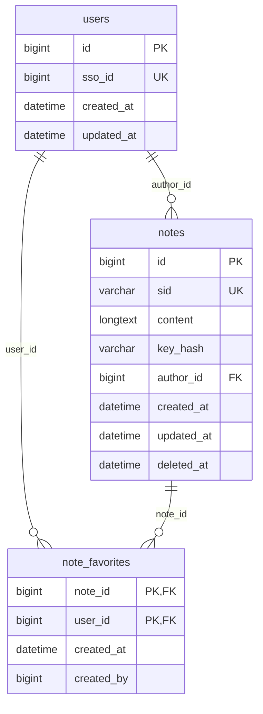

# 数据库设计（重构版）

本文基于当前代码库（`server/database/**`、`server/api/**`）的数据库相关实现整理，目标是为“完全重构”提供可直接落地的数据库设计方案。

## 1. 现状梳理（As-Is）

### 1.1 当前技术栈

- 数据库：MySQL（Prisma `provider = "mysql"`）
- ORM：Prisma + `prisma-extension-pagination`
- Schema 文件：`server/database/schema.prisma`
- 迁移目录：`server/database/migrations/*`

### 1.2 当前数据模型

#### `Note`

- `id`：自增主键
- `sid`：便签外部标识（当前为 `Text`，**无唯一约束**）
- `content`：正文（`Text`）
- `key`：加密口令（可空，明文存储）
- `authorId`：作者 SSO ID（可空，关联 `User.ssoId`）

#### `User`

- `id`：自增主键
- `ssoId`：SSO 用户 ID（唯一）

#### `NoteOnUsers`

- 复合主键：`(noteId, userId)`
- `noteId` -> `Note.id`
- `userId` -> `User.ssoId`
- `assignedAt`：收藏时间
- `assignedBy`：操作人（字符串）

### 1.3 关系

- `User (ssoId)` 1 - N `Note (authorId)`
- `User (ssoId)` N - N `Note (id)`，通过 `NoteOnUsers`

### 1.4 主要访问模式（来自 repo/api）

- `queryNote(sid)`：按 `sid` 查询单条（`findFirst`）
- `updateNote`：按 `id` 更新 `content/key`
- `createNote`：按 `sid` 创建，`content` 初始为空字符串
- `deleteNote(sid)`：按 `sid` 批量删除（`deleteMany`）
- `getUserNote(ssoId)`：按 `authorId` 分页查询
- `getUserFavourNote(ssoId)`：按收藏关系分页查询
- 收藏/取消收藏：对 `NoteOnUsers` 新增/删除

### 1.5 现状问题（重构驱动）

1. `sid` 业务上应唯一，但数据库已无唯一索引，导致：
   - 读使用 `findFirst`（返回不确定）
   - 删使用 `deleteMany`（可能误删多条）
2. `key` 明文存储，存在安全风险。
3. 缺少审计字段（`createdAt` / `updatedAt`），分页也无稳定排序字段。
4. 删除 `Note` 时，`NoteOnUsers` 外键为 `RESTRICT`，有收藏时可能删除失败。
5. 关系大量依赖外部自然键 `ssoId`，内部引用不统一（扩展性弱）。
6. migration 中存在大小写混用（`Note` / `note`），跨环境风险高。

---

## 2. 重构目标模型（To-Be）

设计原则：

- 用内部主键做关联（`users.id`），外部 ID（`sso_id`）只做业务唯一键。
- 保证 `sid` 全局唯一，支撑幂等写入与稳定路由。
- 收藏关系采用级联删除，避免孤儿记录和删除失败。
- 引入审计字段，统一分页排序规则。
- 口令不落明文，只存哈希。

### 2.1 ER 图



### 2.2 表结构定义（建议）

#### `users`

- `id BIGINT UNSIGNED`：主键自增
- `sso_id BIGINT UNSIGNED NOT NULL UNIQUE`
- `created_at DATETIME(3) NOT NULL DEFAULT CURRENT_TIMESTAMP(3)`
- `updated_at DATETIME(3) NOT NULL DEFAULT CURRENT_TIMESTAMP(3) ON UPDATE CURRENT_TIMESTAMP(3)`

#### `notes`

- `id BIGINT UNSIGNED`：主键自增
- `sid VARCHAR(64) NOT NULL UNIQUE`
- `content LONGTEXT NOT NULL`
- `key_hash VARCHAR(255) NULL`（替代原 `key` 明文）
- `author_id BIGINT UNSIGNED NULL` -> `users.id`（`ON DELETE SET NULL`）
- `created_at / updated_at`：审计时间
- `deleted_at DATETIME(3) NULL`（可选，支持软删除）

#### `note_favorites`

- `note_id BIGINT UNSIGNED NOT NULL` -> `notes.id`（`ON DELETE CASCADE`）
- `user_id BIGINT UNSIGNED NOT NULL` -> `users.id`（`ON DELETE CASCADE`）
- `created_at DATETIME(3) NOT NULL DEFAULT CURRENT_TIMESTAMP(3)`
- `created_by BIGINT UNSIGNED NULL`（可选，记录操作者）
- 主键：`(note_id, user_id)`

### 2.3 索引设计

- `notes.uk_sid (sid)`：路由查询与幂等写入
- `notes.idx_author_updated (author_id, updated_at DESC)`：我的便签分页
- `note_favorites.idx_user (user_id)`：外键约束与级联删除稳定性
- `note_favorites.idx_user_created (user_id, created_at DESC)`：我的收藏分页
- `note_favorites.idx_note (note_id)`：反查收藏数/级联效率

### 2.4 查询与接口映射建议

- `GET /api/getNote?sid=...`：`notes` 通过唯一 `sid` 精确查找。
- `POST /api/updateNote`：
  - 先按 `sid` 查，不存在时创建（建议事务内 upsert）。
  - 若 `key_hash` 存在，则做口令校验（哈希比对）。
- `GET /api/getUserNote`：按 `author_id` + `updated_at DESC` 分页。
- `GET /api/getFavourNote`：`note_favorites.user_id` 联表 `notes`，按收藏时间倒序分页。
- 删除便签：优先软删除；若物理删除，依赖 `note_favorites` 级联。

---

## 3. 迁移方案（建议分阶段）

### 阶段 A：结构扩展（向后兼容）

1. 新增 `users.id` 关联链路所需字段（如 `notes.author_id_new`、`note_favorites.user_id_new`）。
2. 新增审计字段：`created_at`、`updated_at`。
3. 新增 `notes.key_hash`，保留旧 `key`（双写期）。

### 阶段 B：数据回填

1. `notes.author_id_new` 通过 `users.sso_id -> users.id` 回填。
2. `note_favorites.user_id_new` 同步回填。
3. 对 `key` 进行哈希迁移到 `key_hash`（可按访问懒迁移）。
4. 清理重复 `sid`（保留最新一条，其余归档/合并）。

### 阶段 C：切流与收敛

1. 仓储层改为只读写新字段（`users.id`、`key_hash`）。
2. 强制 `notes.sid` 唯一。
3. 外键改为级联策略。
4. 删除旧字段（`key`、旧外键列）并补齐索引。

---

## 4. Prisma 建模建议（示例）

> 以下仅示意字段与关系方向，实际以迁移后命名为准。

```prisma
model User {
  id         BigInt   @id @default(autoincrement()) @db.UnsignedBigInt
  ssoId      BigInt   @unique @map("sso_id") @db.UnsignedBigInt
  notes      Note[]
  favourites NoteFavorite[]
  createdAt  DateTime @default(now()) @map("created_at")
  updatedAt  DateTime @updatedAt @map("updated_at")

  @@map("users")
}

model Note {
  id         BigInt         @id @default(autoincrement()) @db.UnsignedBigInt
  sid        String         @unique @db.VarChar(64)
  content    String         @db.LongText
  keyHash    String?        @map("key_hash") @db.VarChar(255)
  authorId   BigInt?        @map("author_id") @db.UnsignedBigInt
  author     User?          @relation(fields: [authorId], references: [id], onDelete: SetNull)
  favourites NoteFavorite[]
  createdAt  DateTime       @default(now()) @map("created_at")
  updatedAt  DateTime       @updatedAt @map("updated_at")
  deletedAt  DateTime?      @map("deleted_at")

  @@index([authorId, updatedAt(sort: Desc)], map: "idx_author_updated")
  @@map("notes")
}

model NoteFavorite {
  noteId    BigInt   @map("note_id") @db.UnsignedBigInt
  userId    BigInt   @map("user_id") @db.UnsignedBigInt
  note      Note     @relation(fields: [noteId], references: [id], onDelete: Cascade)
  user      User     @relation(fields: [userId], references: [id], onDelete: Cascade)
  createdAt DateTime @default(now()) @map("created_at")

  @@id([noteId, userId])
  @@index([userId], map: "idx_user")
  @@index([userId, createdAt(sort: Desc)], map: "idx_user_created")
  @@index([noteId], map: "idx_note")
  @@map("note_favorites")
}
```

---

## 5. 与现有代码对应的最小改造点

1. `queryNote(sid)`：从 `findFirst` 改为 `findUnique({ where: { sid } })`。
2. `deleteNote(sid)`：从 `deleteMany` 改为按唯一 `sid` 删除（或软删）。
3. 分页接口统一加 `orderBy`（`updatedAt DESC` / `createdAt DESC`）。
4. `queryUser` 使用 `upsert`，避免并发首次登录冲突。
5. 收藏操作增加幂等处理（重复收藏不报错或转 `upsert`）。

