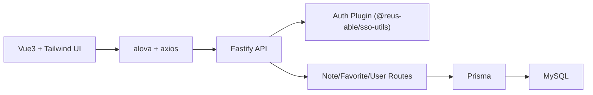

# 重构技术方案（基于 note.pen + database-design.md）

## 1. 目标与边界

- 目标：按设计稿重构便签产品，统一在线便签、登录态与“我的便签/收藏”能力。
- 前端固定选型：`Vue3 + TailwindCSS + alova.js + axios`。
- 后端选型：`Fastify`，SSO 对接使用 `@reus-able/sso-utils`。
- 数据库：MySQL，采用 [database-design.md](./database-design.md) 中的 `users / notes / note_favorites` 目标模型。

---

## 2. 设计稿到页面信息架构映射

`docs/note.pen` 顶层共 6 个页面 Frame，建议映射如下：

1. `Frame`（未登录首页）
   - 顶部状态区（登录按钮）
   - ID 输入区
   - 两个入口按钮（在线便签 / 本地便签）
2. `登录后状态/SSO弹窗`
   - 首页内容 + 遮罩层 + 登录确认弹窗（跳转 SSO）
3. `SSO回跳/落地加载页`
   - 顶部状态
   - 中间 loading 卡片（校验票据、建立会话）
4. `已登录首页`
   - 顶部用户状态
   - 入口区（与未登录态结构一致，但行为升级）
5. `用户信息弹窗页`
   - 用户头部信息
   - `我的创建 / 我的收藏` tab 与列表
6. `我的创建tab页`
   - 用户弹窗的 tab 子态（聚焦“我的创建”）

对应路由建议：

- `/`：首页（未登录/已登录两种状态）
- `/auth/callback`：SSO 回跳处理页
- `/note/o/:sid`：在线便签详情
- `/note/l/:sid`：本地便签详情（localStorage）
- 用户信息面板：作为全局弹窗组件，不单独路由

---

## 3. 总体架构

### 3.1 架构图



### 3.2 前端分层

- `views`：页面容器（Home、NoteDetail、AuthCallback）
- `features`：业务模块（auth、note、favorite、user-panel）
- `components`：通用 UI（输入框、按钮、列表项、空态）
- `services/http`：alova 实例、axios requester、API 方法定义
- `stores`：Pinia（仅会话信息和 UI 状态，列表数据由 alova 缓存）

### 3.3 后端分层

- `plugins/auth`：封装 `@reus-able/sso-utils` SSO 校验能力
- `routes/users`：用户注册/查询（`sso_id` 幂等 upsert）
- `routes/notes`：便签读写/删除/口令校验
- `routes/favorites`：收藏与取消收藏、分页列表
- `services/*`：业务逻辑与事务
- `infra/prisma`：Prisma Client、错误映射

---

## 4. 前端技术方案（Vue3 + Tailwind + alova + axios）

### 4.1 请求层（alova + axios）

- 使用 `axios` 统一处理 `baseURL`、超时、错误码。
- 使用 `alova` 管理请求状态、缓存和失效重取。
- token 方案：
  - 登录后将 access token 存于内存 + `localStorage`（可刷新恢复）。
  - axios 请求拦截器自动注入 `Authorization: Bearer ...`。
- 推荐能力：
  - `useRequest`：普通查询
  - `usePagination`：我的创建 / 我的收藏分页
  - `invalidateCache`：保存、删除、收藏后失效对应列表缓存

### 4.2 状态管理

- `authStore`：`isLogged / user / token / loginPending`
- `uiStore`：`userPanelVisible / loginModalVisible`
- 业务数据优先由 alova 管理，Pinia 不重复持有大列表。

### 4.3 页面交互关键点

- 首页输入 `sid`，为空时前端生成随机 ID（10 位）。
- 在线便签首次保存：若不存在则创建（后端按 `sid` upsert 语义）。
- 加密便签：前端只传 `key`，后端写入 `key_hash`；前端不存密钥。
- 收藏按钮：乐观更新 + 失败回滚。
- SSO 回调页：展示 loading，成功后跳回来源页或首页。

---

## 5. 后端技术方案（Fastify + @reus-able/sso-utils）

### 5.1 框架选择

- 采用 `Fastify`，保持高性能与更低框架复杂度。
- API 风格保持 REST，方便前端 alova 对接。

### 5.2 SSO 对接方案

- 在 `plugins/auth` 中接入 `@reus-able/sso-utils` 提供的校验能力，形成统一鉴权入口。
- 统一策略：
  - 公共接口：读取便签（可匿名）
  - 受保护接口：我的便签、我的收藏、收藏操作、创建者写入
- 路由处理器从请求上下文读取 `sso_id`，服务层不直接解析 token。

> 说明：`@reus-able/sso-utils` 具体导出 API 以实际版本为准，建议封装一层 `SsoAuthFacade`（或 `SsoVerifier`），由 Fastify `preHandler`/plugin 调用，避免业务路由耦合三方库细节。

### 5.3 模块接口建议

- `GET /api/notes/:sid`：获取便签详情（含当前用户是否已收藏）
- `PUT /api/notes/:sid`：更新便签内容（不存在则创建）
- `DELETE /api/notes/:sid`：删除便签（支持 key 校验）
- `GET /api/me/notes?page=&limit=`：我的创建
- `GET /api/me/favorites?page=&limit=`：我的收藏
- `POST /api/notes/:id/favorite`：收藏
- `DELETE /api/notes/:id/favorite`：取消收藏
- `GET /api/auth/callback?ticket=`：SSO 回跳换取会话（或由网关处理）

### 5.4 事务与并发

- “首次保存创建 + 更新”建议置于事务，避免并发下重复创建。
- 收藏使用主键 `(note_id, user_id)` 保证天然幂等。
- 用户首次登录使用 `upsert(sso_id)` 保证并发安全。

---

## 6. 数据库落地（对齐 database-design.md）

沿用 [database-design.md](./database-design.md) 的目标结构：

- `users(id, sso_id, created_at, updated_at)`
- `notes(id, sid unique, content, key_hash, author_id, created_at, updated_at, deleted_at)`
- `note_favorites(note_id, user_id, created_at, created_by, pk(note_id,user_id))`

关键约束与索引：

- `notes.sid` 唯一（替代当前 `findFirst/deleteMany` 风险）
- `notes(author_id, updated_at desc)` 支撑“我的创建”分页
- `note_favorites.user_id` 单列索引支撑外键与级联稳定性
- `note_favorites(user_id, created_at desc)` 支撑“我的收藏”分页
- `note_favorites.note_id` 索引支撑关联与级联

---

## 7. 目录与工程组织（建议）

```txt
repo/
  apps/
    web/               # Vue3 + Vite(or Nuxt)/Tailwind/alova
    api/               # Fastify
  packages/
    shared-types/      # 前后端共享 DTO/类型
    eslint-config/
  docs/
    note.pen
    database-design.md
    tech-solution.md
```

若保持单仓单应用，也建议最少按 `web/` 与 `api/` 分层，避免 UI 与服务端耦合。

---

## 8. 分阶段实施计划

### Phase 1（1 周）：基础骨架

- 搭建前端框架与样式基座（Tailwind 主题、基础组件）
- 搭建 Fastify 插件与 Prisma 基础设施
- 完成 SSO 鉴权主链路（登录、回调、会话恢复）

### Phase 2（1 周）：核心业务

- 完成在线便签 CRUD + 密钥校验
- 完成我的创建/收藏分页接口与页面
- 完成收藏幂等、列表缓存失效策略

### Phase 3（0.5~1 周）：迁移与质量

- 落地数据库迁移（按 database-design 三阶段）
- 增加 E2E（登录、创建、收藏、删除）与核心单测
- 性能与稳定性收敛（慢查询、错误映射、日志追踪）

---

## 9. 风险与决策点

- `@reus-able/sso-utils` 的 API 形态需先做 PoC，确认在 Fastify 中以 plugin + preHandler 封装的接入方式。
- 若历史库中存在重复 `sid`，上线前必须先完成清洗策略。
- 是否启用 `notes.deleted_at`（软删）需产品侧明确；若不需要可先物理删。
- 本地便签是否长期保留独立路由（`/note/l/:sid`）需产品确认，避免后续 URL 语义变更。
